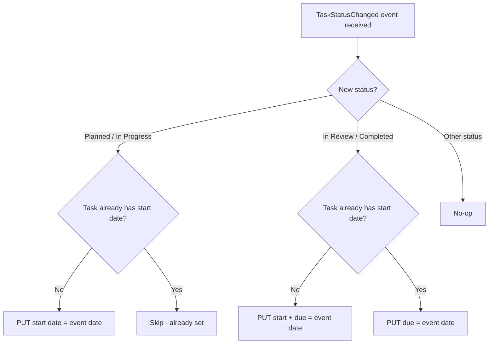

# feat: Auto-set Wrike task dates on status change

## Overview

When a Wrike task's status changes to "Planned" or "In Progress", automatically set its native start date to the event date. When a task moves to "In Review" or "Completed", automatically set its native due date to the event date. If a task reaches "In Review" or "Completed" without ever having a start date (i.e., it skipped Planned/In Progress), set both start and due to the same date. This uses the existing webhook infrastructure and the existing but unused `WrikeClient.put()` method.

## Problem Frame

Tasks in Wrike don't automatically get start/end dates when their status changes. The team wants:
- Tasks entering the pipeline (Planned or In Progress) to get a start date
- Tasks reaching completion (In Review or Completed) to get a due/end date
- Tasks that skip the pipeline stages to still get both dates filled in

The infrastructure already exists: the webhook handler stores transitions, the Wrike client has a PUT method, and the status IDs are known. The missing piece is the write-back logic.

## Requirements Trace

- R1. When a task moves to "Planned" or "In Progress" status, set its Wrike native `start` date to the event date (if not already set)
- R2. When a task moves to "In Review" or "Completed" status, set its Wrike native `due` date to the event date
- R3. When a task moves to "In Review" or "Completed" and has no existing `start` date, set both `start` and `due` to the same event date
- R4. Date writes must not block the webhook response (use `after()` for non-blocking execution)
- R5. Date writes must not create webhook loops
- R6. Start date writes must be idempotent (don't overwrite an existing start date)

## Scope Boundaries

- Only native Wrike dates (`start`/`due`) -- not custom fields
- Only webhook-triggered -- no cron-based catch-up (can be added later)
- Four target statuses: Planned, In Progress, In Review, Completed
- No retroactive date-setting for existing tasks (except the two test tasks below)
- No UI changes to the dashboard

## Context & Research

### Relevant Code and Patterns

- `src/app/api/webhook/wrike/route.ts` -- Webhook handler; already filters `TaskStatusChanged` events and uses `after()` for async post-response work (handshake). This is the insertion point.
- `src/lib/wrike/webhook.ts` -- `storeTransition()` function and `WrikeWebhookEvent` type with `taskId`, `customStatusId`, `lastUpdatedDate`
- `src/lib/wrike/client.ts` -- `WrikeClient.put()` method (lines 128-184), fully implemented with throttle/retry but never called. Uses `Record<string, string>` body with `URLSearchParams` encoding.
- `src/lib/wrike/fetcher.ts` -- `resolveWorkflowStatuses()` returns `ResolvedStatuses` with `plannedIds`, `completedIds`, `inReviewId`, `inProgressId`. Cached in memory.
- `src/lib/config.ts` -- Status name configuration; `completedStatusNames: ["Completed", "Approved", "Complete"]`

### Known Status IDs (Client Work workflow)

| Status | ID | Trigger |
|--------|-----|---------|
| Planned | `IEAGV532JMGNL7LQ` | Set `start` date |
| In Progress | `IEAGV532JMGNL7L2` | Set `start` date |
| In Review | `IEAGV532JMHGJR2T` | Set `due` date (+ `start` if missing) |
| Completed | `IEAGV532JMGNL7LH` | Set `due` date (+ `start` if missing) |

### Wrike API Date Update

PUT `/tasks/{taskId}` with form-encoded body: `dates={"start":"2026-04-16"}` or `dates={"start":"2026-04-16","due":"2026-04-16"}`. The `put()` method already handles this encoding -- pass `{ dates: JSON.stringify({start: "2026-04-16", due: "2026-04-16"}) }`.

## Key Technical Decisions

- **Use `after()` for write-back**: The webhook must respond quickly to Wrike. Date writes happen post-response using Next.js `after()`, which is already used for the handshake flow. This keeps the webhook response fast and prevents timeout issues.
- **Use `resolveWorkflowStatuses()` for status matching**: Rather than hardcoding status IDs in the write-back logic, reuse the existing status resolution that maps config names to IDs. This keeps the mapping centralized.
- **Skip start date write if already set**: Before writing, fetch the task to check if the start date already has a value. This prevents overwriting manually-set dates and handles re-entry scenarios (task bouncing back to Planned).
- **Always write due date**: Due date is always overwritten on completion/review -- the latest date is most accurate.
- **Backfill start date on completion**: If a task skips Planned/In Progress and goes directly to In Review or Completed, set both start and due to the same date so there's never a due date without a start date.
- **No webhook loop risk**: Wrike's `TaskStatusChanged` event type is only triggered by status changes, not date changes. Updating dates via PUT will not trigger a `TaskStatusChanged` event, so there is no loop.

## Open Questions

### Resolved During Planning

- **Native dates vs custom fields?** -> Native dates (`start`/`due`). User confirmed.
- **Webhook loop risk?** -> No risk. `TaskStatusChanged` fires on status changes only, not date updates.
- **Which date value to use?** -> Use `event.lastUpdatedDate` (the timestamp of the status change), truncated to date (YYYY-MM-DD).
- **What about tasks that skip Planned/In Progress?** -> Set both start and due to the same date on completion.
- **Which statuses trigger start date?** -> Planned AND In Progress (not just Planned).
- **Which statuses trigger due date?** -> In Review AND Completed.

### Deferred to Implementation

- **Error logging format** -> Follow existing `console.log("[webhook]")` pattern but exact messages deferred.

## High-Level Technical Design

> *This illustrates the intended approach and is directional guidance for review, not implementation specification. The implementing agent should treat it as context, not code to reproduce.*

## Implementation Units

- [x] **Unit 1: Create date write-back module**

**Goal:** Build a function that, given a webhook event, determines whether to set start/due dates and calls the Wrike API.

**Requirements:** R1, R2, R3, R5, R6

**Dependencies:** None -- uses existing `WrikeClient.put()`, `WrikeClient.get()`, and `resolveWorkflowStatuses()`

**Files:**
- Create: `src/lib/wrike/dateWriter.ts`
- Test: `src/lib/wrike/__tests__/dateWriter.test.ts`

**Approach:**
- Export a function that accepts a `WrikeWebhookEvent`
- Resolve statuses via `resolveWorkflowStatuses()`
- Check if `event.customStatusId` (the new status) is in `plannedIds` or equals `inProgressId` -> start date trigger
- Check if `event.customStatusId` is in `completedIds` or equals `inReviewId` -> due date trigger
- If neither matches, return early (no-op)
- Extract the date portion (YYYY-MM-DD) from `event.lastUpdatedDate`
- Fetch the task via GET to check existing dates
- For start date trigger: skip if start already set, otherwise PUT start date
- For due date trigger: always set due date. Additionally, if start is not set, set both start and due to the same date
- Log the outcome

**Patterns to follow:**
- `src/lib/wrike/webhook.ts` -- module structure, error handling, logging with `[webhook]` prefix
- `src/lib/wrike/fetcher.ts` -- use of `resolveWorkflowStatuses()` and `getWrikeClient()`

**Test scenarios:**
- Happy path: Event with `customStatusId` matching Planned -> calls PUT with `dates.start` set to event date
- Happy path: Event with `customStatusId` matching In Progress -> calls PUT with `dates.start` set to event date
- Happy path: Event with `customStatusId` matching Completed (task has start date) -> calls PUT with `dates.due` only
- Happy path: Event with `customStatusId` matching In Review (task has start date) -> calls PUT with `dates.due` only
- Happy path: Event with `customStatusId` matching Completed (task has NO start date) -> calls PUT with both `dates.start` and `dates.due` set to event date
- Happy path: Event with `customStatusId` matching In Review (task has NO start date) -> calls PUT with both `dates.start` and `dates.due` set to event date
- Edge case: Event with `customStatusId` not matching any target status -> no PUT call made
- Edge case: Task already has a start date and is moved to Planned again -> PUT is skipped (no overwrite)
- Error path: Wrike PUT call fails -> error is logged, does not throw (non-blocking context)
- Edge case: `lastUpdatedDate` timestamp is correctly truncated to YYYY-MM-DD date string

**Verification:**
- The function correctly maps status IDs to date fields
- Wrike PUT is called with the correct path and body format
- When a task with no start date reaches completion, both dates are set
- Errors are caught and logged without propagating

---

- [x] **Unit 2: Wire date writer into webhook handler**

**Goal:** Call the date write-back function from the webhook handler using `after()` so it runs after the response is sent.

**Requirements:** R4

**Dependencies:** Unit 1

**Files:**
- Modify: `src/app/api/webhook/wrike/route.ts`
- Test: `src/app/api/webhook/wrike/__tests__/route.test.ts`

**Approach:**
- Import the date writer function from `src/lib/wrike/dateWriter.ts`
- Inside the event loop (or after `Promise.all`), use `after()` to schedule date writes for each `TaskStatusChanged` event
- The `after()` callback should call the date writer for each relevant event
- Keep `storeTransition()` in the synchronous path (before response) as it already is
- The date write is fire-and-forget -- errors are logged but don't affect the webhook response

**Patterns to follow:**
- Existing `after()` usage in the handshake block (lines 15-17 of `route.ts`)
- Existing event loop pattern (lines 47-52)

**Test scenarios:**
- Integration: Webhook receives a TaskStatusChanged event for In Progress status -> `storeTransition()` runs before response, date writer runs via `after()`
- Integration: Webhook receives multiple events in one payload -> each event gets its own date write call
- Integration: Webhook receives a non-TaskStatusChanged event -> no date write scheduled
- Error path: Date writer throws inside `after()` -> webhook response is unaffected (already sent 200)

**Verification:**
- Webhook still responds 200 immediately
- Date writes happen asynchronously after response
- Existing transition storage behavior is unchanged

---

- [ ] **Unit 3: Add test infrastructure (if not yet present)**

**Goal:** Set up a minimal test runner so Units 1 and 2 can have automated tests.

**Requirements:** Supports R1-R6 verification

**Dependencies:** None -- can be done in parallel with Unit 1

**Files:**
- Modify: `package.json` (add test runner dependency and script)
- Create: `vitest.config.ts` or equivalent

**Approach:**
- Add `vitest` as a dev dependency (lightweight, works well with Next.js/TypeScript)
- Add a `test` script to `package.json`
- Minimal config -- no special setup beyond TypeScript/path alias resolution

**Test expectation: none** -- this unit is pure scaffolding. Its verification is that Unit 1 and 2 tests can run.

**Verification:**
- `npm test` (or equivalent) runs and exits cleanly

---

- [x] **Unit 4: Live API verification with real Wrike tasks**

**Goal:** Verify the implementation works end-to-end using real Wrike tasks via the API. The implementer must not ask the user to test -- use the Wrike API directly to verify.

**Requirements:** R1, R2, R3, R6

**Dependencies:** Units 1, 2

**Files:**
- No new files -- this is API-driven verification

**Approach:**
- **Test 1 -- Start date (task 4436675991):** This task was moved to In Progress on 2026-04-16. After implementing, use the Wrike API to call the date writer for this task (or simulate the webhook event). Then GET the task and verify that `dates.start` is set to `2026-04-16`.
- **Test 2 -- Completed date + backfill (task 4436659651):** This task has already moved past In Review or Completed. Use the Wrike API to call the date writer for this task. Then GET the task and verify that both `dates.start` and `dates.due` are set. If the task had no prior start date, both should be the same date.
- Verification must be done programmatically via the API -- do not ask the user to check anything manually.

**Test scenarios:**
- Integration: Task 4436675991 -- after date writer runs, GET task shows `dates.start` = `2026-04-16`
- Integration: Task 4436659651 -- after date writer runs, GET task shows both `dates.start` and `dates.due` populated. If start was missing, both dates match.

**Verification:**
- API GET confirms dates are correctly set on both test tasks
- No errors in the process
- The implementer confirms success via API response, not manual user checking

## Coding Instructions

**Do not stop. Do not ask the user to test things. Do not ask the user to check things. Use the Wrike API to verify everything yourself. Once you are 100% sure that everything is working, then you can stop working.**

## System-Wide Impact

- **Interaction graph:** The webhook handler gains a new side effect (Wrike PUT) in addition to its existing Redis write. The PUT uses `after()` so it does not affect the webhook response path.
- **Error propagation:** Errors in the date writer are logged but do not propagate to the webhook response or affect transition storage. The `after()` boundary isolates them.
- **State lifecycle risks:** If the Vercel function is cold-started, `resolveWorkflowStatuses()` will make a Wrike API call to fetch workflows before the date write can proceed. This adds latency to the `after()` callback but does not affect the response.
- **API surface parity:** No dashboard API changes. The webhook endpoint behavior is unchanged from the caller's (Wrike's) perspective -- it still returns 200 immediately.
- **Unchanged invariants:** All existing webhook behavior (HMAC validation, transition storage, handshake) is unchanged. The dashboard's read-only data flow is unaffected. The cron sync job is not modified.

## Risks & Dependencies

| Risk | Mitigation |
|------|------------|
| Wrike API rate limiting during burst webhook events | Existing throttle (1100ms between requests) handles this. Date writes queue behind the throttle chain. |
| `after()` callback silently fails on Vercel | Add try/catch with console.error logging inside the callback. Vercel logs capture `after()` output. |
| Status ID mismatch between config and actual workflow | Use `resolveWorkflowStatuses()` which fetches live workflow data and includes hardcoded fallbacks for the Client Work space. |
| Overwriting manually-set start dates | Check existing date before writing start; skip if already set. |
| Task skips pipeline stages | Backfill both start and due when completing a task with no start date (R3). |

## Sources & References

- Related code: `src/lib/wrike/client.ts` (PUT method), `src/app/api/webhook/wrike/route.ts` (webhook handler)
- Related code: `src/lib/wrike/fetcher.ts` (status resolution), `src/lib/config.ts` (status names)
- Test task 1 (start date): Wrike task ID 4436675991 -- moved to In Progress 2026-04-16
- Test task 2 (completed + backfill): Wrike task ID 4436659651 -- already past In Review/Completed
